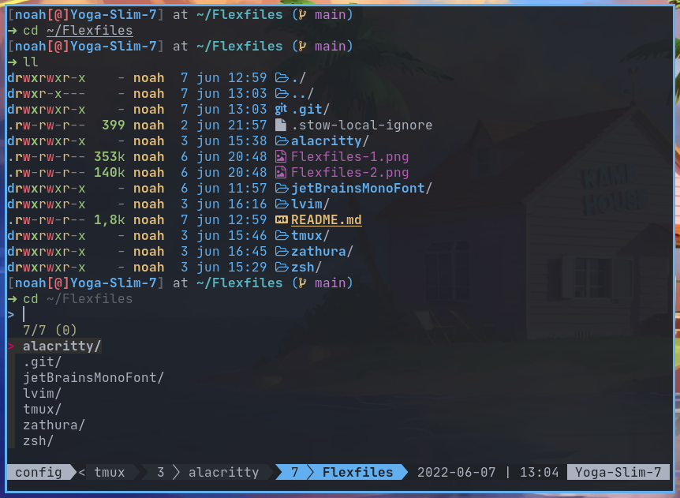
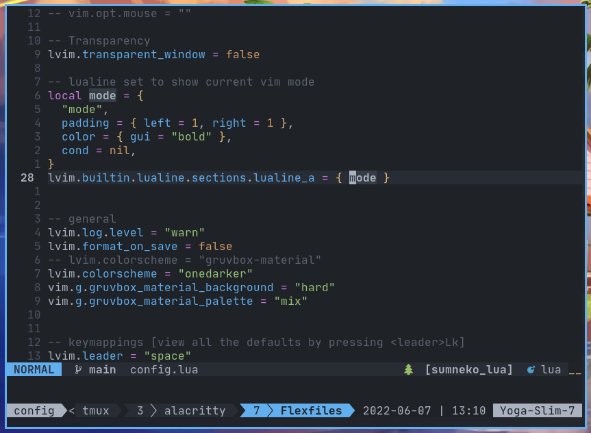

# Flexfiles

My Dotfiles.

Feel free to use/steal anything 🙂





## Table of Contents

- [Installation](#Installation)
- [Programs](#Programs)

## Installation

You will need `git` and GNU `stow`

Clone into your `$HOME` directory or `~`

```bash
git clone https://github.com/NoahHakansson/Flexfiles.git ~
```

Run `stow` to symlink everything or just select what you want

```bash
stow */ # Everything (the '/' ignores the README)
```

```bash
stow zsh # Just my zsh config
```

## Programs

A non-exhaustive list of programs that I use.

- [Alacritty](https://github.com/alacritty/alacritty)
- [LunarVim](https://www.lunarvim.org)
- [Neovim](https://neovim.io/)
- [Zathura](https://pwmt.org/projects/zathura/)
- [Tmux](https://github.com/tmux/tmux)
- [Bear](https://github.com/rizsotto/Bear)
- [Bismuth](https://github.com/Bismuth-Forge/bismuth)
- [patat](https://github.com/jaspervdj/patat)
- [fzf](https://github.com/junegunn/fzf)
- [sway](https://swaywm.org/)
- [waybar](https://github.com/Alexays/Waybar)
- [mako](https://github.com/emersion/mako)
- wofi
- dmenu
- nmcli
- git
- stow
- make
- pip
- npm
- node
- [fnm](https://github.com/Schniz/fnm)
- cargo

